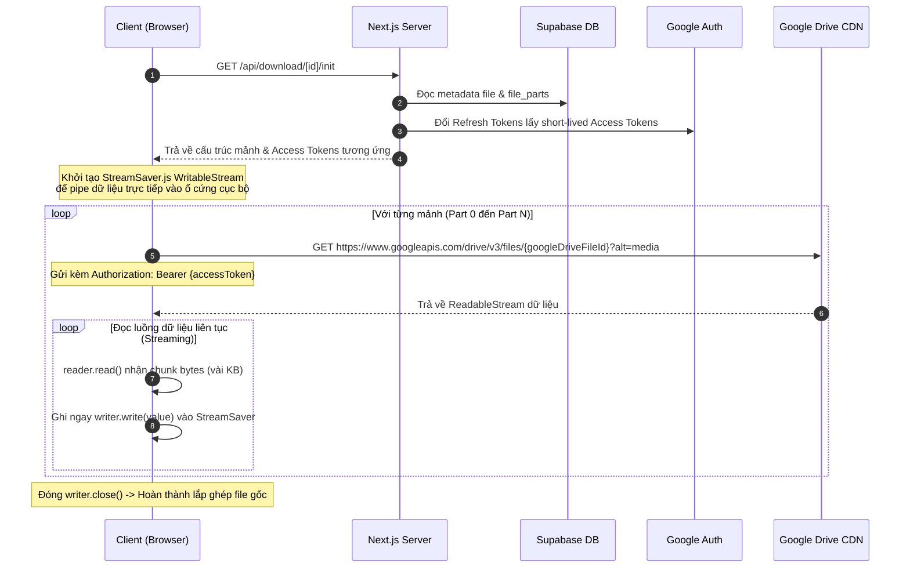
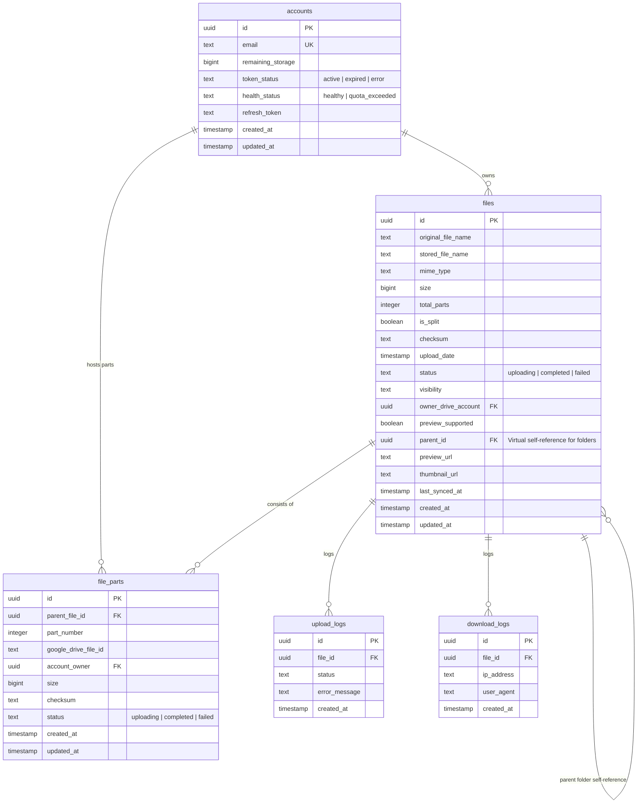

# BẢN PHÂN TÍCH VÀ TỔNG HỢP KIẾN TRÚC KỸ THUẬT DỰ ÁN
## Hệ thống Google Drive Multi-Account NAS ("Poor Man's NAS")

Tài liệu này cung cấp một cái nhìn khách quan, chi tiết và thực tế về kiến trúc hệ thống, các quyết định thiết kế kỹ thuật, hạn chế hiện tại và đánh giá mức độ sẵn sàng vận hành của dự án Google Drive Multi-Account NAS từ góc nhìn của một Senior Software Engineer.

---

## 1. Project Overview (Tổng Quan Dự Án)

Dự án **Google Drive Multi-Account NAS** là một hệ thống lưu trữ đám mây tự vận hành (self-hosted cloud storage solution) viết bằng **Next.js 16 (App Router)**, **React 19**, **Tailwind CSS v4** và **Supabase PostgreSQL**. 

Mục tiêu cốt lõi của dự án là thiết lập một **Unified Storage Pool** bằng cách hợp nhất dung lượng của nhiều tài khoản Google Drive cá nhân (phiên bản miễn phí 15GB) thông qua giao thức OAuth 2.0. Hệ thống quản lý cấu trúc thư mục ảo trong cơ sở dữ liệu và tự động chia nhỏ (chunking/splitting) các tệp lớn thành các mảnh (shards) có kích thước cấu hình trước (mặc định là 1GB) để phân tán chúng lên các tài khoản lưu trữ backend khác nhau.

Về mặt giao diện, ứng dụng áp dụng phong cách thiết kế **Neo-Brutalism** sử dụng các đường viền dày sắc nét (`border-2 border-black`), đổ bóng cứng (`shadow-[4px_4px_0px_#000000]`), và bảng màu tương phản cao nhằm tối ưu hóa khả năng phản hồi trực giác của người dùng mà không cần phụ thuộc vào các thư viện giao diện nặng nề.

---

## 2. Problem This Project Solves (Bài Toán Dự Án Giải Quyết)

Hệ thống giải quyết ba vấn đề kỹ thuật và kinh tế chính của các giải pháp lưu trữ cá nhân:

1. **Hợp nhất tài nguyên lưu trữ phân tán**: Gom dung lượng từ nhiều tài khoản Google Drive riêng lẻ thành một không gian lưu trữ duy nhất. Điều này cho phép lưu trữ các tệp có kích thước lớn hơn dung lượng trống tối đa của một tài khoản đơn lẻ bằng cách chia nhỏ tệp và lưu rải rác trên nhiều tài khoản.
2. **Khắc phục giới hạn băng thông và tài nguyên máy chủ (Zero Server-Bandwidth/Memory Exhaustion)**: Trong các hệ thống lưu trữ proxy truyền thống, dữ liệu từ client khi tải lên hoặc tải xuống đều phải truyền qua máy chủ trung gian (VPS). Điều này gây tốn kém băng thông VPS và dễ làm tràn bộ nhớ (RAM) máy chủ khi xử lý luồng tệp tin lớn. Dự án này giải quyết triệt để bằng cách chỉ thực hiện các luồng điều khiển (control plane) trên server Next.js, trong khi toàn bộ luồng truyền tải byte dữ liệu (data plane) được thực hiện trực tiếp giữa trình duyệt của client và các API endpoint của Google Drive CDN.
3. **Quản lý bảo mật quyền truy cập**: Giúp người dùng quản lý tệp tin trên nhiều tài khoản Google Drive mà không cần lộ đường dẫn trực tiếp (Google Drive shareable links) hoặc chia sẻ quyền truy cập tài khoản gốc cho người dùng cuối.

---

## 3. Current Architecture (Kiến Trúc Hệ Thống Hiện Tại)

Hệ thống được thiết kế theo mô hình tách biệt giữa **Control Plane** (Mặt phẳng điều khiển) và **Data Plane** (Mặt phẳng dữ liệu):

```mermaid
graph TD
    subgraph Client [Client Layer - Browser]
        FE[React 19 SPA / Next.js Client]
        SS[StreamSaver.js / Service Worker]
        XHR[Parallel XMLHttpRequest Workers]
    end

    subgraph Server [Server Layer - Next.js Control Plane]
        API[Stateless API Routes]
        TC[In-memory Token Cache]
    end

    subgraph DB [Database Layer]
        Supa[(Supabase PostgreSQL)]
    end

    subgraph Storage [Storage Backend]
        GD1[Google Drive Account A]
        GD2[Google Drive Account B]
        GD3[Google Drive Account C]
    end

    %% Control Plane Operations
    FE <--> |API requests / JSON| API
    API <--> |Metadata Queries| Supa
    API -.-> |OAuth 2.0 Credentials Refresh| Storage

    %% Data Plane Operations (Bypassing Server)
    XHR ==> |Direct Resumable PUT Upload| GD1
    XHR ==> |Direct Resumable PUT Upload| GD2
    SS <== |Direct GET Stream Download| GD1
    SS <== |Direct GET Stream Download| GD2
```

### Phân tích các thành phần kiến trúc:

*   **Client Layer**: Thực hiện các thao tác tốn tài nguyên xử lý dữ liệu như chia cắt tệp (`file.slice()`), theo dõi tiến độ upload từng phần thông qua sự kiện `xhr.upload.onprogress`, và biên dịch/ghi luồng tải xuống trực tiếp vào ổ cứng cục bộ thông qua `StreamSaver.js` để tránh sập tab trình duyệt do cạn kiệt bộ nhớ RAM.
*   **Server Layer (Stateless Orchestrator)**: Next.js API Routes đóng vai trò là một điều phối viên không lưu trạng thái (stateless). Server chịu trách nhiệm sinh liên kết tải lên tuần tự (Resumable Upload URLs), tạo chữ ký số JWT, quản lý session và lưu trữ đệm access token trong bộ nhớ. Server tuyệt đối không xử lý hoặc trung chuyển byte dữ liệu của tệp tin.
*   **Database Layer**: Supabase PostgreSQL lưu trữ metadata của hệ thống file ảo (tệp, thư mục, liên kết mảnh tệp, nhật ký vận hành). Bảo mật dữ liệu được kiểm soát một phần thông qua Row Level Security (RLS) của PostgreSQL, mặc dù các API routes backend đang sử dụng `Service Role Key` để bỏ qua RLS và thực hiện các tác vụ quản trị trực tiếp.
*   **Storage Backend**: Các tài khoản Google Drive cá nhân được kết nối thông qua OAuth 2.0. Hệ thống áp dụng **Nguyên tắc phân quyền tối thiểu (Principle of Least Privilege)** bằng cách chỉ yêu cầu scope `https://www.googleapis.com/auth/drive.file`. Hệ thống chỉ có quyền quản lý các tệp do chính nó tải lên, hoàn toàn không thể đọc hoặc làm ảnh hưởng đến các dữ liệu cá nhân sẵn có của người dùng trên Drive.

---

## 4. Core Technical Flows (Các Luồng Xử Lý Cốt Lõi)

### 4.1 Luồng Tải Lên Phân Tán (Distributed Upload Flow)

Luồng tải lên được tối ưu hóa để thực hiện phân cắt dữ liệu tại client và tải trực tiếp lên Google CDN:

1.  **Khởi tạo**: Client gọi `POST /api/upload/init` gửi kèm tên tệp, định dạng MIME và kích thước tệp gốc (`size`).
2.  **Tính toán và Phân bổ**: Server Next.js nhận yêu cầu, tính toán số mảnh cần thiết (`totalParts = Math.ceil(size / CHUNK_SIZE)`). Server truy vấn Supabase để lấy danh sách các tài khoản có trạng thái hoạt động tốt (`healthy`, `active`). Nó thực hiện một vòng lặp khớp dung lượng (fit-matching) để gán từng phần tệp cho tài khoản có dung lượng trống phù hợp.
3.  **Khởi tạo Resumable Upload**: Với mỗi phần tệp, Server gọi API Google Drive để lấy một `Resumable Upload Session URL` duy nhất.
4.  **Trả về Control Info**: Server lưu một bản ghi tệp có trạng thái `uploading` vào Supabase và trả về cho client: `fileId`, danh sách `uploadUrl` tương ứng với các mảnh, và kích thước mảnh tệp (`chunkSize`).
5.  **Tải lên song song tại Client**: Client sử dụng `file.slice(start, end)` để cắt tệp thành các khối `Blob`. Nó khởi tạo song song các luồng `XMLHttpRequest` gửi trực tiếp dữ liệu dạng `PUT` lên các địa chỉ Google Upload URL đã nhận. Việc sử dụng XHR thay vì `fetch` cho phép theo dõi sát sao tiến độ tải lên của từng mảnh qua `xhr.upload.onprogress`.
6.  **Hoàn tất**: Sau khi toàn bộ các mảnh báo trạng thái HTTP 200 từ Google, client thu thập các Google File ID được trả về và gửi yêu cầu `POST /api/upload/complete` tới Server. Server lưu metadata các mảnh vào bảng `file_parts`, cập nhật trạng thái tệp gốc thành `completed`, và kích hoạt các luồng xử lý bất đồng bộ ở background để cập nhật dung lượng ổ đĩa và cấu hình quyền xem công khai cho tệp tin phục vụ tính năng xem trước.

---

### 4.2 Luồng Tải Xuống Hợp Nhất (Distributed Download Stream Flow)

Để tải xuống các tệp tin cực lớn mà không làm quá tải RAM của trình duyệt khách hoặc băng thông của máy chủ Next.js, hệ thống sử dụng cơ chế gom luồng stream trực tiếp tại client:



*   **Lợi thế bộ nhớ**: Thay vì tải toàn bộ các mảnh tệp tin về bộ nhớ RAM (dưới dạng `Blob` lớn) rồi mới tiến hành ghép tệp (gây tràn RAM và sập tab trình duyệt khi file lớn hơn 2GB), luồng dữ liệu được đọc tuần tự theo cơ chế **backpressure**. Từng khối byte dữ liệu nhỏ (vài chục Kilobytes) khi vừa được tải về từ Google Drive sẽ lập tức được ghi thẳng xuống đĩa cứng thông qua kênh truyền Service Worker của `StreamSaver.js`. Bộ nhớ đệm RAM luôn được duy trì ở mức cực kỳ thấp và không đổi trong suốt quá trình tải xuống.

---

### 4.3 Luồng Xem Trước & Tạo Cache Thumbnail (Preview & Thumbnail Cache)

Hệ thống cung cấp tính năng xem trước trực tiếp tài liệu, hình ảnh và video thông qua hạ tầng CDN của Google Drive:

1.  **Kiểm tra Cache**: Khi client yêu cầu xem trước tại `GET /api/files/[id]/preview`, Server kiểm tra trạng thái cache trong DB. Nếu các trường `preview_url` và `thumbnail_url` đã tồn tại và chưa hết hạn, hệ thống trả về ngay lập tức với độ trễ tối thiểu (**< 30ms**).
2.  **Sinh liên kết động và Đồng bộ phân quyền**: Nếu chưa có cache, Server xác định mảnh tệp tin đầu tiên (Part 0) làm mảnh đại diện.
3.  **Mở quyền đọc công khai**: Hệ thống thực hiện một truy vấn tới Google Drive API để cấp quyền đọc công khai (`role: reader`, `type: anyone`) cho riêng mảnh tệp tin đó.
4.  **Chuyển đổi URL tối ưu**:
    *   Với tệp tin hình ảnh: Server trích xuất `thumbnailLink` từ Google Drive, nâng cấp tham số kích thước độ phân giải lên chất lượng cao (`=s1600` thay vì `=s220` mặc định) để hiển thị sắc nét.
    *   Với tệp tin đa phương tiện và tài liệu khác (PDF, Word, Excel, Video): Server lấy `webViewLink` từ Google Drive API và tự động chuyển đổi hậu tố `/view` thành `/preview` để sẵn sàng nhúng trực tiếp vào các thẻ `<iframe>` hiển thị trên giao diện người dùng.
5.  **Lưu Cache**: Các liên kết này được cập nhật ngược lại vào Supabase kèm theo thời gian đồng bộ `last_synced_at` nhằm phục vụ cho các yêu cầu kế tiếp.

---

## 5. Database Design (Chi Tiết Cấu Trúc Cơ Sở Dữ Liệu)

> [!WARNING]
> **Phát hiện lỗi không đồng nhất cấu trúc dữ liệu (Schema Drift)**:
> File đặc tả cấu trúc cơ sở dữ liệu vật lý [schema.sql](file:///c:/Users/Dungx/Desktop/DungxDownload/supabase/schema.sql) hiện tại trong mã nguồn **thiếu trường `parent_id`** trong bảng `files`. Tuy nhiên, trong mã nguồn thực tế của ứng dụng (ví dụ: các file `create-folder/route.ts`, `move/route.ts`), cột `parent_id` đang được gọi liên tục để xây dựng cấu trúc cây thư mục ảo. Đây là một khoản nợ kỹ thuật (technical debt) cần được đồng bộ hóa lại trong tệp tin SQL để tránh lỗi khởi tạo cơ sở dữ liệu mới.

Dưới đây là cấu trúc thực tế của cơ sở dữ liệu Supabase PostgreSQL đang vận hành hệ thống:



---

## 6. Performance Decisions (Các Quyết Định Tối Ưu Hiệu Năng)

Hệ thống chứa một số quyết định thiết kế kỹ thuật thông minh mang lại hiệu năng cao trong môi trường tự vận hành kinh phí thấp:

1.  **Thiết kế Stateless API & Ủy quyền Truyền tải**: Quyết định không cho dữ liệu tệp chạy qua luồng xử lý của máy chủ Node.js/Next.js giúp loại bỏ hoàn toàn các vấn đề về nghẽn cổ chai I/O, quá tải băng thông mạng của server, và giới hạn thời gian thực thi (request timeout) thường gặp trên các nền tảng Serverless (Vercel/Netlify).
2.  **Bộ nhớ đệm Access Token (In-memory Map Token Cache)**: Tại [src/lib/google.ts](file:///c:/Users/Dungx/Desktop/DungxDownload/src/lib/google.ts#L42-L66), hệ thống triển khai một biến `tokenCache` kiểu `Map` toàn cục lưu trữ Access Token kèm thời gian hết hạn (`expiryTime`). Thay vì phải gửi yêu cầu HTTP xác thực lại với máy chủ OAuth của Google ở mỗi lượt truy cập tệp tin (mất trung bình 400ms - 600ms độ trễ mạng), hệ thống đọc trực tiếp token còn hiệu lực từ RAM, giúp giảm thời gian phản hồi API rõ rệt.
3.  **Tải lên song song đa tuyến (Parallel Uploading)**: Khi tệp tin bị chia nhỏ thành nhiều mảnh, trình duyệt thực hiện gửi đồng thời (parallel) các yêu cầu tải lên lên các máy chủ CDN khác nhau của Google Drive. Phương pháp này tận dụng tối đa băng thông đường truyền tải lên của client, cho tốc độ tải lên nhanh hơn đáng kể so với phương pháp tải lên tuần tự truyền thống.
4.  **Xử lý Bất đồng bộ Hậu kỳ (Asynchronous Background Tasks)**: Sau khi tệp tải lên hoàn tất, các tác vụ nặng như cập nhật dung lượng ổ đĩa khả dụng của tài khoản (`refreshAccountQuota`), phân quyền đọc tệp công khai trên Drive, và tải metadata ảnh xem trước được bọc trong các khối hàm chạy ẩn (IIFE - Immediately Invoked Function Expression) bất đồng bộ. Phản hồi HTTP 200 được trả ngay lập tức về cho client mà không cần chờ đợi các tác vụ hậu kỳ này hoàn thành.

---

## 7. Current Limitations & Technical Debt (Hạn Chế Hiện Tại & Nợ Kỹ Thuật)

Dù có thiết kế kiến trúc thông minh, hệ thống vẫn tồn tại những hạn chế và lỗ hổng kỹ thuật cần được khắc phục trước khi đưa vào vận hành thực tế:

### 7.1 Lỗi logic phân bổ dung lượng trong luồng tải lên (Allocation Race Condition)
Trong [src/app/api/upload/init/route.ts](file:///c:/Users/Dungx/Desktop/DungxDownload/src/app/api/upload/init/route.ts#L38-L54), vòng lặp phân bổ các phần tệp tin thực hiện kiểm tra điều kiện dung lượng còn trống của tài khoản dựa trên mảng `accounts` tĩnh lấy ra từ database:
```typescript
const account = accounts.find(a => Number(a.remaining_storage) > partSize);
```
**Vấn đề**: Dung lượng khả dụng `remaining_storage` trong mảng `accounts` này không được trừ tạm tính trong bộ nhớ (in-memory deduction) sau khi gán một mảnh tệp cho tài khoản đó. 
*Ví dụ*: Nếu Tài khoản A chỉ còn 1.5GB trống, và ta tải lên một tệp tin dung lượng 2.5GB (chia làm 3 mảnh: Part 1 - 1GB, Part 2 - 1GB, Part 3 - 0.5GB). Trong vòng lặp gán mảnh:
*   Part 1 (1GB): Tài khoản A đủ điều kiện (1.5GB > 1GB) -> Gán cho Tài khoản A.
*   Part 2 (1GB): Hệ thống vẫn kiểm tra dựa trên giá trị cũ (1.5GB > 1GB) -> Tiếp tục gán Part 2 cho Tài khoản A.
*   Part 3 (0.5GB): Vẫn thỏa mãn -> Tiếp tục gán Part 3 cho Tài khoản A.

Khi client tiến hành tải lên song song thực tế, Google Drive của Tài khoản A sẽ lập tức báo lỗi vượt quá giới hạn dung lượng (Quota Exceeded) ở mảnh thứ hai, khiến toàn bộ tiến trình tải lên thất bại.

### 7.2 Lộ Access Token tại Client (Security Token Exposure)
Để thực hiện tải xuống trực tiếp từ Google CDN về trình duyệt, API [GET /api/download/[id]/init](file:///c:/Users/Dungx/Desktop/DungxDownload/src/app/api/download/%5Bid%5D/init/route.ts) trả về danh sách các mảnh kèm theo **Google Access Token** trực tiếp dưới dạng bản rõ (plain text) về trình duyệt của người dùng cuối.
*   **Rủi ro**: Mặc dù Access Token này có thời hạn ngắn (1 giờ) và bị giới hạn phạm vi trong scope `drive.file`, việc phơi bày token quản trị này ra ngoài client vẫn tạo cơ hội cho những người dùng có hiểu biết về kỹ thuật trích xuất token này ra để thực hiện các hành vi đọc, ghi hoặc xóa trái phép bất kỳ tệp tin nào khác do ứng dụng này tải lên trên tài khoản Drive đó.

### 7.3 Thiếu cơ chế phục hồi và tải lại (Fragile Fault-tolerance)
Hệ thống tải lên dựa hoàn toàn vào tính ổn định mạng của client trong suốt quá trình truyền tải. Nếu một trong các mảnh gặp sự cố mất kết nối mạng giữa chừng, luồng tải lên sẽ bị hủy bỏ hoàn toàn hoặc bị treo vô hạn. Không có hàng đợi tự động thử lại (automatic retry queue), cơ chế phục hồi lỗi (fault-tolerance), hay tính năng tiếp tục tải lên từ điểm gián đoạn (chunk-based upload resume) được triển khai ở phía client.

### 7.4 Mã nguồn Auth Proxy bị bỏ hoang (Orphaned Auth Middleware)
Tệp tin [src/proxy.ts](file:///c:/Users/Dungx/Desktop/DungxDownload/src/proxy.ts) được phát triển nhằm mục đích làm chốt chặn bảo mật bảo vệ các tuyến đường `/dashboard/*` và `/api/admin/*` bằng cách kiểm tra và xác thực JWT token trong cookie `admin_session`.
*   **Vấn đề**: Next.js yêu cầu tệp tin middleware cấu hình hệ thống phải được đặt tên chính xác là `middleware.ts` ở thư mục gốc hoặc thư mục `src/`. Do tệp này hiện đang được đặt tên là `proxy.ts` và không có cơ chế liên kết hay import nào kích hoạt nó trong luồng chạy của Next.js, **tất cả các trang dashboard quản trị và API quản trị hiện đang hoàn toàn mở, không hề được bảo vệ bởi bất kỳ lớp xác thực nào** nếu người dùng truy cập trực tiếp bằng đường dẫn URL.

### 7.5 Sai lệch cấu hình SQL (Database Schema Drift)
Như đã nêu ở phần cảnh báo, tệp tin cấu trúc cơ sở dữ liệu mẫu [supabase/schema.sql](file:///c:/Users/Dungx/Desktop/DungxDownload/supabase/schema.sql) thiếu trường khóa ngoại `parent_id` tự liên kết trong bảng `files`. Nếu một kỹ sư mới tham gia dự án sử dụng tệp này để cài đặt cơ sở dữ liệu trên một môi trường Supabase mới, hệ thống sẽ gặp lỗi nghiêm trọng (Crash) ngay khi cố gắng tạo thư mục ảo hoặc di chuyển tệp tin.

---

## 8. Future Engineering Priorities (Các Ưu Tiên Kỹ Thuật Sắp Tới)

Để đưa dự án từ trạng thái thử nghiệm sang hoạt động thực tế ổn định, đội ngũ kỹ sư cần tập trung giải quyết các đầu việc kỹ thuật sau:

1.  **Sửa lỗi giải thuật phân bổ dung lượng (In-memory Quota Deduction)**:
    Sửa đổi tệp [src/app/api/upload/init/route.ts](file:///c:/Users/Dungx/Desktop/DungxDownload/src/app/api/upload/init/route.ts) để cập nhật một biến theo dõi dung lượng ảo của các tài khoản ngay trong vòng lặp gán mảnh. Đảm bảo rằng sau khi gán một mảnh có kích thước `S` cho Tài khoản `X`, dung lượng khả dụng của `X` trong bộ nhớ dùng để tính toán gán cho mảnh tiếp theo sẽ là `remaining_storage - S`.
2.  **Khôi phục chốt chặn bảo mật Middleware**:
    Đổi tên file [src/proxy.ts](file:///c:/Users/Dungx/Desktop/DungxDownload/src/proxy.ts) thành `src/middleware.ts` để Next.js tự động nhận diện và kích hoạt hệ thống bảo vệ phiên đăng nhập JWT trên toàn bộ các route admin, ngăn chặn truy cập trái phép.
3.  **Đồng bộ hóa Database Schema**:
    Cập nhật ngay tệp [supabase/schema.sql](file:///c:/Users/Dungx/Desktop/DungxDownload/supabase/schema.sql) để bổ sung cột `parent_id` có ràng buộc tham chiếu khóa ngoại tự liên kết (self-referencing foreign key pointing to `files(id) ON DELETE CASCADE`) nhằm đảm bảo tính toàn vẹn dữ liệu cho sơ đồ thư mục ảo.
4.  **Xây dựng bộ điều khiển tải lên kiên cố tại Client (Resilient Client-Side Uploader)**:
    Tái cấu trúc luồng tải lên trong [src/app/dashboard/page.tsx](file:///c:/Users/Dungx/Desktop/DungxDownload/src/app/dashboard/page.tsx) bằng cách áp dụng giải thuật **Exponential Backoff Retry** (thử lại với độ trễ tăng dần) khi xảy ra sự cố mạng trong quá trình PUT khối byte. Tích hợp cơ chế lưu trữ trạng thái tải lên dở dang vào `localStorage` để cho phép người dùng tiếp tục truyền tải (resume) khi kết nối mạng được khôi phục.
5.  **Áp dụng giải thuật cân bằng tải thực sự cho các mảnh lớn (Disk Balancing)**:
    Thay thế logic chọn tài khoản đầu tiên đủ điều kiện trong luồng tải lên tệp lớn bằng giải thuật sắp xếp tài khoản có dung lượng trống nhiều nhất lên đầu (tương tự giải thuật đang áp dụng cho việc tạo tệp văn bản nhỏ tại `create-text/route.ts`), giúp phân bổ đều tải trọng lưu trữ trên toàn bộ storage pool.

---

## 9. Technical Evaluation (Đánh Giá Kỹ Thuật Độc Lập)

| Tiêu chí | Điểm mạnh thực tế | Điểm yếu / Nợ kỹ thuật tồn đọng |
| :--- | :--- | :--- |
| **Kiến trúc hệ thống** | Tách biệt hoàn hảo giữa Control Plane và Data Plane. Tiết kiệm tối đa băng thông, tài nguyên máy chủ điều phối và chi phí vận hành VPS. | Expose mã Access Token trực tiếp về phía Client. Chưa có cơ chế mã hóa trung gian để che giấu token này khi tải xuống. |
| **Độ bền bỉ & Tin cậy** | Sử dụng API Resumable Upload chuẩn của Google giúp tối ưu hóa luồng ghi tệp lớn từ phía máy chủ Google CDN. | Logic gán mảnh bị lỗi toán học (Race Condition) trong vòng lặp phân bổ dung lượng; thiếu tính năng tự phục hồi lỗi truyền tải tại Client. |
| **Mức độ Bảo mật** | Sử dụng scope giới hạn nghiêm ngặt `drive.file` bảo vệ an toàn tuyệt đối các tệp tin cá nhân có sẵn ngoài ứng dụng của người dùng. | Middleware bảo mật đăng nhập (`proxy.ts`) bị đặt sai tên dẫn đến vô hiệu hóa, tạo sơ hở nghiêm trọng cho toàn bộ Dashboard. |
| **Cơ sở dữ liệu** | Thiết kế bảng chuẩn hóa, có cơ chế lưu log lỗi chi tiết phục vụ cho việc debug. Có sẵn cơ chế đánh chỉ mục quan hệ thư mục ảo. | SQL Schema lưu trữ trong repository bị lệch pha (Schema Drift) so với mã nguồn thực tế của ứng dụng Next.js. |
| **Hiệu năng & Trải nghiệm** | Tốc độ tải lên song song cực tốt; StreamSaver tải xuống trực tiếp ghi file vào đĩa cứng giúp duy trì RAM trình duyệt luôn ở mức an toàn. | Chưa có giải thuật cân bằng tải thông minh cho các mảnh tệp lớn (mới chỉ thực hiện tuần tự tìm tài khoản đầu tiên vừa khớp). |

---

## 10. Honest Production Readiness Assessment (Đánh Giá Sẵn Sàng Vận Hành)

Dựa trên các phân tích kỹ thuật phía trên, hệ thống hiện tại **CHƯA ĐỦ ĐIỀU KIỆN SẴN SÀNG ĐỂ VẬN HÀNH THỰC TẾ (NOT PRODUCTION-READY)**.

Dự án hiện đang dừng lại ở trạng thái một **Bản thử nghiệm chất lượng cao (High-Fidelity Prototype / MVP)**, hoạt động rất tốt trong môi trường lab cá nhân, homelab hoặc phục vụ mục đích trình diễn kỹ năng phát triển phần mềm (portfolio). 

### Lý do chưa thể release thương mại:
1.  **Lỗ hổng bảo mật nghiêm trọng**: Việc hệ thống bỏ quên file middleware xác thực đăng nhập khiến bất cứ ai biết địa chỉ IP của server đều có thể toàn quyền truy cập, chỉnh sửa, xóa tệp tin và trích xuất thông tin tài khoản Google Drive liên kết.
2.  **Khả năng chịu lỗi kém**: Trong môi trường mạng Internet thực tế (đặc biệt là thiết bị di động hoặc mạng không dây chập chờn), việc thiếu cơ chế retry và phục hồi tải lên cho từng mảnh 1GB sẽ khiến trải nghiệm người dùng trở nên cực kỳ tệ do tỷ lệ tải lên thất bại giữa chừng rất cao.
3.  **Lỗi logic tràn dung lượng**: Lỗi toán học không trừ tạm tính dung lượng khi phân mảnh chắc chắn sẽ gây ra lỗi Quota Exceeded khi người dùng tải lên các tệp tin lớn hơn dung lượng trống lớn nhất của một tài khoản thành viên đơn lẻ.

**Kết luận**: Hệ thống sở hữu một nền tảng kiến trúc cực kỳ tiềm năng, thông minh và tiết kiệm tài nguyên. Tuy nhiên, để thực sự đưa vào môi trường Production ổn định, bắt buộc phải thực hiện các ưu tiên cải tiến kỹ thuật được nêu tại mục số 8.
