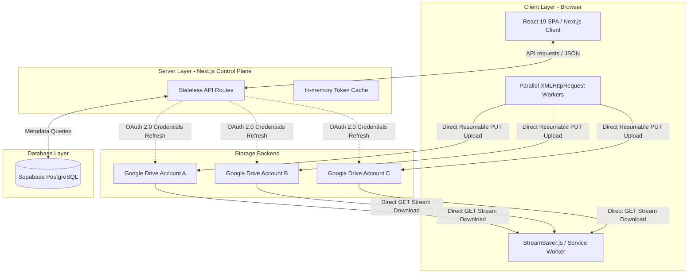

# Google Drive Multi-Account NAS ("Poor Man's NAS")

Một hệ thống lưu trữ đám mây tự vận hành (self-hosted), hợp nhất và tổng hợp dung lượng từ nhiều tài khoản Google Drive miễn phí thành một không gian lưu trữ ảo duy nhất (Unified Storage Pool).

Dự án được xây dựng trên **Next.js 16 + Supabase**, triển khai trên **Vercel Serverless**. Kiến trúc tách biệt hoàn toàn Control Plane (Next.js API Routes) và Data Plane (Google Drive CDN), giúp ứng dụng không tốn bất kỳ băng thông hay RAM máy chủ nào khi trung chuyển dữ liệu.

---

## 🏛️ Sơ Đồ Kiến Trúc Hệ Thống (System Architecture)



---

## ⚙️ Điểm Nhấn Kiến Trúc Kỹ Thuật

*   **Tách biệt Control Plane và Data Plane**: Byte dữ liệu của tệp tin (upload/download) chạy trực tiếp giữa Trình duyệt và Google CDN. Server Next.js chỉ xử lý các metadata điều khiển, giúp loại bỏ nghẽn cổ chai I/O trên máy chủ điều phối.
*   **Chia nhỏ tệp tự động (File Splitting/Chunking)**: Các tệp tin lớn hơn kích thước định cấu hình (mặc định 1GB) sẽ được tự động phân chia thành các mảnh (shards) và phân tán thông minh lên các tài khoản lưu trữ khác nhau.
*   **Tải xuống trực tiếp dạng Luồng (Direct Stream Download)**: Ghép tệp trực tiếp phía client thông qua Service Worker của `StreamSaver.js`. Dữ liệu tải về từ Google Drive CDN được pipe trực tiếp xuống ổ đĩa cứng của người dùng dưới cơ chế Backpressure, duy trì lượng RAM sử dụng của trình duyệt ở mức cực thấp (vài KB) bất kể kích thước tệp tải xuống là bao nhiêu GB.
*   **Nguyên tắc Phân quyền Tối thiểu (Principle of Least Privilege)**: Đăng nhập tài khoản qua OAuth 2.0 với scope duy nhất là `drive.file`. Ứng dụng chỉ có quyền đọc/ghi các tệp do chính nó tải lên, bảo đảm an toàn tuyệt đối cho các tệp cá nhân sẵn có khác của người dùng.
*   **Xem trước và Ảnh thu nhỏ siêu tốc**: Chuyển đổi và cache các liên kết `thumbnailLink` và `webViewLink` từ Google API vào Supabase PostgreSQL, tối ưu hóa thời gian phản hồi cho các yêu cầu xem trước kế tiếp xuống dưới **< 30ms**.

---

## 📁 Cấu Trúc Thư Mục Dự Án

*   `src/app/api`: Các API Route xử lý xác thực OAuth, khởi tạo luồng tải lên (`/upload/init`), ghi nhận tải lên thành công (`/upload/complete`), đồng bộ dung lượng, di chuyển tệp ảo và tạo thư mục ảo.
*   `src/app/dashboard`: Trang quản trị tệp tin và tài khoản sử dụng React 19 Client-side và thiết kế Neo-Brutalism.
*   `src/lib`: Thư viện kết nối Google APIs, quản lý phiên đăng nhập JWT và tích hợp Supabase.
*   `supabase/`: Tệp định nghĩa cấu trúc cơ sở dữ liệu vật lý PostgreSQL (`schema.sql`).

---

## 🚀 Hướng Dẫn Cài Đặt Nhanh (Quick Start)

### 1. Cấu hình biến môi trường (`.env.local`)

Tạo tệp `.env.local` ở thư mục gốc và điền đầy đủ các thông số:

```bash
NEXT_PUBLIC_SUPABASE_URL="https://your-project.supabase.co"
SUPABASE_SERVICE_ROLE_KEY="your-supabase-service-role-key"

GOOGLE_CLIENT_ID="your-client-id.apps.googleusercontent.com"
GOOGLE_CLIENT_SECRET="your-client-secret"
GOOGLE_REDIRECT_URI="http://localhost:3000/api/auth/google/callback"

ADMIN_PASSWORD="your-admin-dashboard-password"
JWT_SECRET="your-jwt-signing-secret"
ENCRYPTION_SECRET="your-random-encryption-secret-32-chars"

# Kích thước tối đa của mỗi mảnh tệp tin (mặc định 1GB)
CHUNK_SIZE=1073741824
```

### 2. Thiết lập cơ sở dữ liệu (nếu chưa có)

Truy cập **SQL Editor** trong bảng điều khiển Supabase của bạn và chạy nội dung trong tệp `supabase/schema.sql` để tạo lập các bảng thông tin, ràng buộc khóa ngoại và kích hoạt tính năng bảo mật Row Level Security (RLS).

### 3. Cài đặt dependency và chạy local

```powershell
npm install
npm run dev
```

Truy cập [http://localhost:3000](http://localhost:3000) trên trình duyệt để sử dụng ứng dụng.

---

## ☁️ Triển Khai Lên Vercel (Deployment)

### Bước 1: Đẩy mã nguồn lên GitHub

Đảm bảo repo của bạn đã được push lên GitHub (hoặc GitLab/Bitbucket).

### Bước 2: Import dự án lên Vercel

1. Truy cập [vercel.com](https://vercel.com) và đăng nhập.
2. Nhấp **Add New Project** → chọn repo GitHub của dự án.
3. Vercel tự nhận diện đây là dự án Next.js — không cần cấu hình thêm về framework.

### Bước 3: Thiết lập Environment Variables

Trong trang cài đặt dự án trên Vercel, thêm tất cả các biến môi trường sau:

| Biến | Giá trị |
| :--- | :--- |
| `NEXT_PUBLIC_SUPABASE_URL` | URL dự án Supabase |
| `SUPABASE_SERVICE_ROLE_KEY` | Service Role Key của Supabase |
| `GOOGLE_CLIENT_ID` | Client ID từ Google Cloud Console |
| `GOOGLE_CLIENT_SECRET` | Client Secret từ Google Cloud Console |
| `GOOGLE_REDIRECT_URI` | `https://<your-domain>.vercel.app/api/auth/google/callback` |
| `ADMIN_PASSWORD` | Mật khẩu truy cập Dashboard |
| `JWT_SECRET` | Chuỗi bí mật ký JWT session |
| `ENCRYPTION_SECRET` | Chuỗi bí mật mã hóa refresh token trong DB |
| `CHUNK_SIZE` | `1073741824` (1GB, hoặc điều chỉnh tuỳ ý) |

### Bước 4: Cập nhật Google OAuth Redirect URI

> **⚠️ Quan trọng**: Sau khi deploy, bạn **bắt buộc** phải truy cập [Google Cloud Console](https://console.cloud.google.com/) → **APIs & Services** → **Credentials** → Chọn OAuth 2.0 Client ID tương ứng → Thêm URL sau vào danh sách **Authorized redirect URIs**:
> ```
> https://<your-domain>.vercel.app/api/auth/google/callback
> ```
> Nếu bỏ qua bước này, tính năng liên kết tài khoản Google Drive sẽ bị lỗi `redirect_uri_mismatch`.

### Bước 5: Deploy

Nhấp **Deploy**. Vercel sẽ tự động build và triển khai ứng dụng.

---

## 🧠 Phân Tích & Đánh Giá Kỹ Thuật Chuyên Sâu

Để đọc bản đánh giá kỹ thuật toàn diện từ góc nhìn của một **Senior Software Engineer**, bao gồm phân tích chi tiết về:
1. Các quyết định thiết kế tối ưu hóa hiệu năng và bộ đệm (Caching).
2. Giải thuật phân bổ dung lượng ảo (Virtual Quota Allocation).
3. Thiết kế bảo mật phân lớp xác thực và mã hóa token.
4. Đánh giá chi tiết mức độ sẵn sàng vận hành thực tế (Honest Production Readiness).

Vui lòng tham khảo tài liệu phân tích kỹ thuật tại: **[PROJECT_SUMMARY.md](./PROJECT_SUMMARY.md)**.
